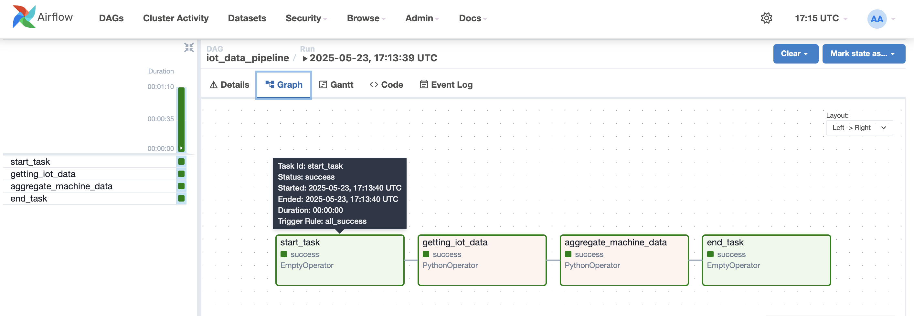
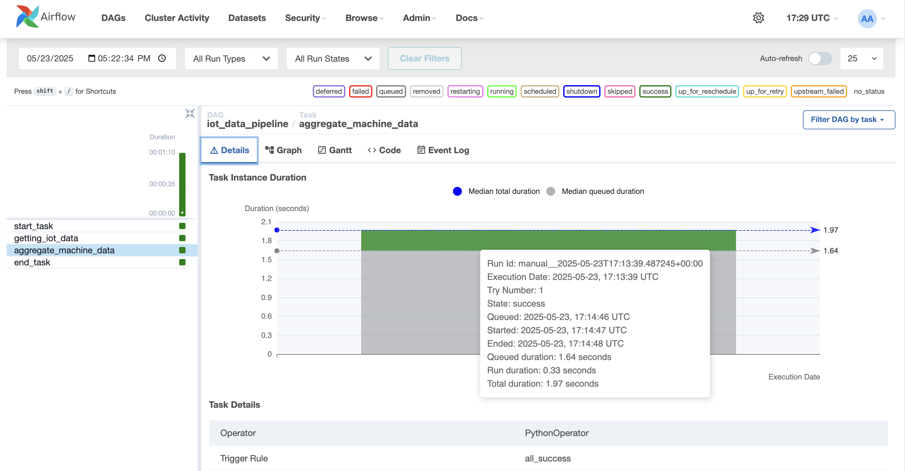
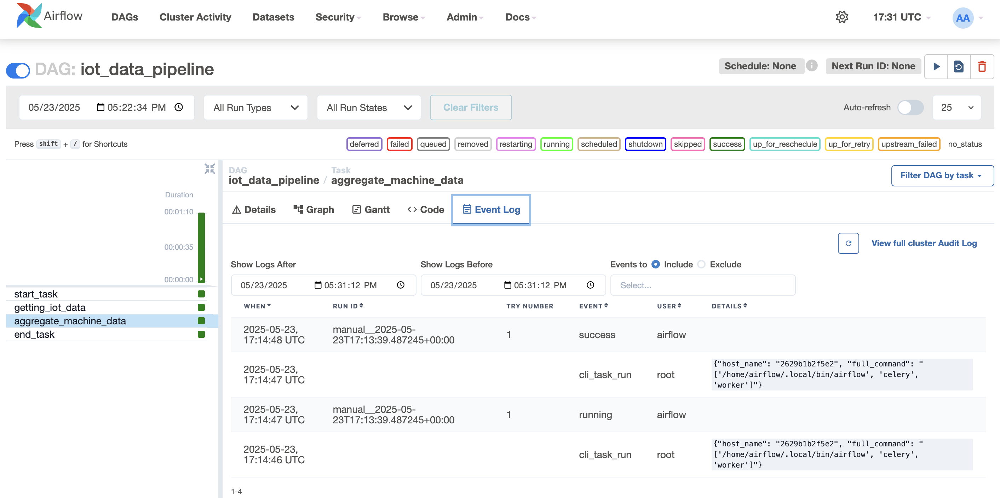
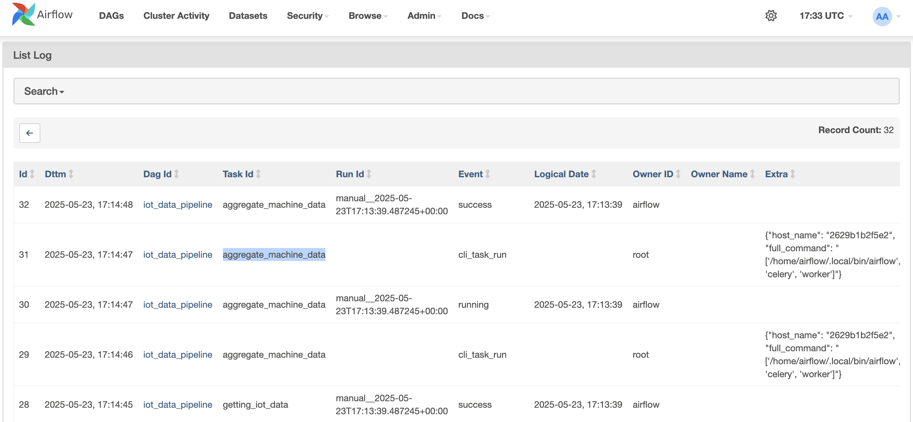

# MLOps Apache Airflow Orchestration

This project demonstrates a simple IoT data pipeline orchestration using Apache Airflow. It simulates collecting IoT device data, processing it, and aggregating the results.

## Project Overview

The project implements a data pipeline that:
1. Simulates collecting IoT device data (binary readings: 0 or 1)
2. Aggregates the collected data
3. Demonstrates basic Airflow DAG (Directed Acyclic Graph) implementation

## Prerequisites

- Docker and Docker Compose
- Python 3.x
- Basic understanding of Apache Airflow concepts

## Project Structure

```
.
├── example-orchestration/
│   ├── dags/              # Contains the IoT data pipeline DAG
│   ├── config/           # Airflow configuration files
│   ├── plugins/          # Custom Airflow plugins
│   ├── logs/            # Airflow logs
│   └── docker-compose.yaml  # Docker configuration
├── photos/              # Screenshots and documentation images
└── README.md
```

## Setup Instructions

1. Set up the Airflow user ID:
   ```bash
   echo "AIRFLOW_UID=$(id -u)" > .env
   ```

2. Initialize the Airflow database:
   ```bash
   docker compose up airflow-init
   ```

3. Start the Airflow services:
   ```bash
   docker compose up
   ```

4. Access the Airflow web interface:
   - URL: http://localhost:8081
   - Default credentials:
     - Username: airflow
     - Password: airflow

## Pipeline Details

The `iot_dag.py` implements a simple IoT data pipeline with the following tasks:

1. `start_task`: Dummy operator to mark the start of the pipeline
2. `getting_iot_data`: Simulates collecting IoT data (60 readings)
3. `aggregate_machine_data`: Aggregates the collected data
4. `end_task`: Dummy operator to mark the end of the pipeline

The pipeline demonstrates:
- Task dependencies
- Data passing between tasks using XCom
- Basic error handling
- Pipeline monitoring

## Pipeline Testing Results

The following screenshots show successful pipeline execution:

* Successful pipeline run as a result of 'iot_data_pipeline' DAG:

* Logs of total aggregated data:




## Important Files

- `docker-compose.yml`: Main configuration file for the Airflow environment
- `airflow.cfg`: Main configuration file for Airflow
- `iot_dag.py`: Contains the IoT data pipeline DAG implementation

## What is a DAG?

A DAG (Directed Acyclic Graph) in Airflow is a collection of tasks that are organized in a specific order to create a workflow. Each task represents a unit of work, and the dependencies between tasks define the execution order. DAGs ensure that tasks are executed in the correct sequence and handle dependencies automatically.


